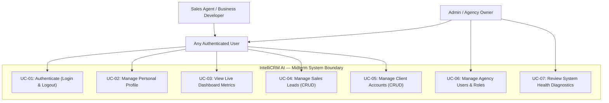

# Use Case Diagram — Midterm Release
## Project: IntelliCRM AI

This document provides the Use Case Diagram for the IntelliCRM AI Midterm build.

---

```mermaid
graph TD
    SalesAgent["Sales Agent / Business Developer"]
    Admin["Admin / Agency Owner"]
    User["Any Authenticated User"]
    
    SalesAgent --> User
    Admin --> User

    subgraph IntelliCRM_AI_Boundary ["IntelliCRM AI — Midterm System Boundary"]
        UC01["UC-01: Authenticate (Login & Logout)"]
        UC02["UC-02: Manage Personal Profile"]
        UC03["UC-03: View Live Dashboard Metrics"]
        UC04["UC-04: Manage Sales Leads (CRUD)"]
        UC05["UC-05: Manage Client Accounts (CRUD)"]
        UC06["UC-06: Manage Agency Users & Roles"]
        UC07["UC-07: Review System Health Diagnostics"]
    end

    User --> UC01
    User --> UC02
    User --> UC03
    User --> UC04
    User --> UC05

    Admin --> UC06
    Admin --> UC07
```
